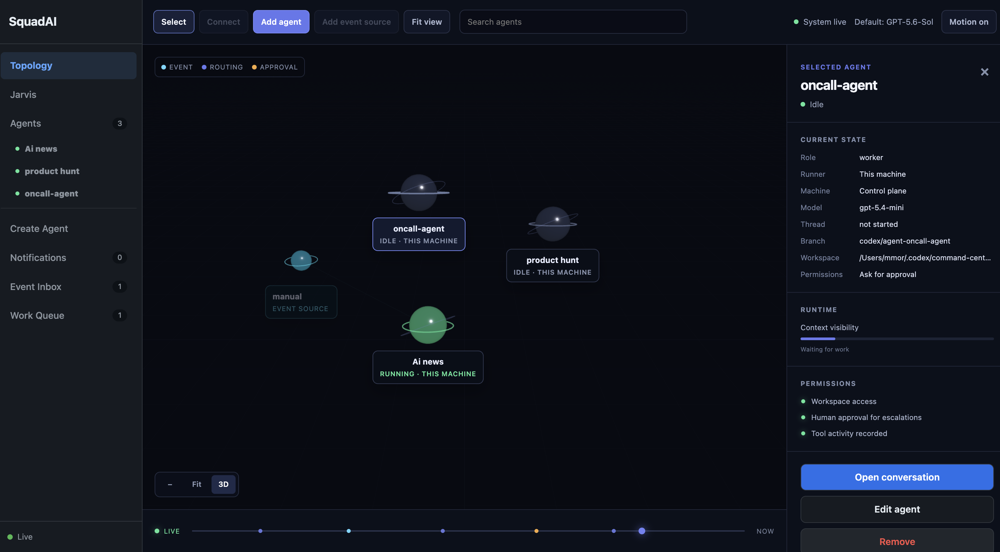

# SquadAI

**A control plane for running teams of Codex agents.**

SquadAI turns Codex from a collection of individual conversations into an
observable, event-driven system. Create agents once, assign work from a browser
or API, keep full conversation and tool history, approve sensitive actions, and
run agents on the machines where their code and tools already live.



> SquadAI is an early-stage project. It currently uses Codex as its agent
> runtime and `codex app-server` as the underlying control interface.

## Why SquadAI?

Coding agents are already effective when a person opens one conversation and
gives it one task. The roughness appears when you need several agents, recurring
work, parallel tasks, or long-running workflows:

- conversations become difficult to find and supervise;
- work must be copied manually from one tool or agent to another;
- nothing is listening for new work while you are away;
- multiple tasks aimed at one repository need isolated workspaces;
- approvals, failures, model changes, and unfinished work need one visible home;
- agents may need to run on different laptops, workstations, or VMs.

SquadAI provides the missing operational layer. Codex remains responsible for
reasoning, coding, tools, MCP servers, skills, plugins, and sandboxing. SquadAI
is responsible for organizing agents and work around it.

## What You Get

- **One command center:** See agents, live status, conversations, commentary,
  tool activity, approvals, events, and queued work in one browser UI.
- **Persistent agents:** Resume Codex threads instead of starting every task
  from an empty conversation.
- **Event-driven work:** Send work from issue trackers, webhooks, monitors,
  schedulers, or any system that can call an HTTP endpoint.
- **Reusable or isolated execution:** Reuse one long-running agent for a stream
  of events, or automatically create a separate agent instance for every task.
- **Human control:** Choose Ask for approval, Approve for me, or Full access,
  and answer approval requests from the conversation.
- **Repository isolation:** Git repositories use managed worktrees so parallel
  agent tasks do not edit the same checkout.
- **Remote runners:** Keep the control plane on one machine while agents run
  where the repositories, credentials, skills, plugins, and MCP servers exist.
- **Easy machine enrollment:** Add a Windows, macOS, or Linux runner from the
  UI with one expiring command over a private Tailscale connection.
- **Live runner inventory:** See every control-plane and remote machine,
  connection status, assigned agents, active work, and last heartbeat.
- **Telegram team chat:** Give selected agents their own Telegram bots, tag
  them in one group, and receive their work, approvals, and final summaries in
  the same conversation.
- **Shared skill library:** Import a user skill from one runner and install it
  on another without creating a temporary agent or spending model tokens.
- **Upgrade awareness:** Detect incompatible pinned model settings and request
  a migration decision instead of repeatedly failing without explanation.

## How It Works

```text
People / webhooks / monitors / Telegram
            |
            v
  +-----------------------+
  | SquadAI control plane |
  | UI, API, SQLite, work |
  | queue, approvals      |
  +-----------+-----------+
              |
       commands and events
              |
       +------+------+
       |             |
       v             v
  Local runner   Remote runner(s)
       |             |
       v             v
  codex app-server on each runner machine
       |
       v
  Repositories, Git worktrees, tools, skills, plugins, and MCP servers
```

The control plane stores coordination state and presents the UI. A runner
executes Codex sessions on its own machine and connects outward to the control
plane. This means source code and machine-local tools do not have to be copied
to the control-plane host.

## Core Concepts

### Agent

An agent is a reusable configuration: name, instructions, working directory,
model settings, permissions, selected skills, and runner. Its Codex thread is
created lazily and persisted for later conversations.

### Agent instance

For task-oriented work, SquadAI can create an isolated instance from a base
agent automatically. Each instance receives its own conversation and, for Git
repositories, its own worktree and branch. The current defaults allow three
active instances and five unresolved instances per base agent.

### Event and work item

An event is an external signal. It may directly target an agent or wait for
assignment/routing. Once accepted, it becomes a durable work item that SquadAI
dispatches when the target is available.

### Control plane and runner

The control plane owns visibility and coordination. The runner owns execution.
They can run in one process on one computer or on separate machines.

## Quick Start: Everything On One Machine

### 1. Install the prerequisites

You need:

- [Node.js](https://nodejs.org/) 22.13 or newer;
- npm, which is included with Node.js;
- [Git](https://git-scm.com/);
- the Codex CLI, installed and authenticated.

Optional, depending on how you use SquadAI:

- [Tailscale](https://tailscale.com/download) on every machine when adding
  remote runners through the recommended private-network flow;
- Telegram and BotFather when using Telegram group control;
- [VS Code](https://code.visualstudio.com/) and SSH access to a remote runner
  when using **Open in VS Code** remotely.

SquadAI supports macOS, Linux, and Windows.

### 2. Download and install the Codex CLI

SquadAI does not bundle Codex. Every machine that runs agents must have the
Codex CLI installed and signed in.

#### macOS or Linux

Use the official standalone installer:

```bash
curl -fsSL https://chatgpt.com/codex/install.sh | sh
```

Alternatively, install with npm:

```bash
npm install -g @openai/codex
```

On macOS, Homebrew is also supported:

```bash
brew install --cask codex
```

#### Windows

Run the official installer from PowerShell:

```powershell
powershell -ExecutionPolicy ByPass -c "irm https://chatgpt.com/codex/install.ps1 | iex"
```

You can also use npm from PowerShell or Command Prompt:

```powershell
npm install -g @openai/codex
```

See the [official Codex quickstart](https://developers.openai.com/codex/quickstart?setup=cli)
for the latest installation options.

### 3. Sign in to Codex and verify it

Run Codex once and follow the sign-in flow for your ChatGPT account or OpenAI
API key:

```bash
codex
```

You can also start authentication explicitly:

```bash
codex login
```

Then verify that SquadAI can reach the required interface:

```bash
codex --version
codex app-server --help
```

`codex app-server` comes with Codex; there is no separate App Server package to
download.

### 4. Install SquadAI

From the repository root, build the control library first:

```bash
cd codex-control
npm ci
npm run build
```

Then install the manager:

```bash
cd ../codex-agent-manager
npm ci
npm run build
```

### 5. Start SquadAI

Still inside `codex-agent-manager`, run:

```bash
npm start -- --mode embedded --host 127.0.0.1 --port 4317
```

Open [http://127.0.0.1:4317](http://127.0.0.1:4317) in your browser.

### 6. Create your first agent

1. Open **Create Agent**.
2. Give the agent a clear name, such as `Repository Coder`.
3. Select the repository or working directory it should operate in.
4. Add durable instructions describing its role and constraints.
5. Choose its model, reasoning level, permissions, and skills.
6. Create the agent and open it from the agent list or topology.
7. Send a task in plain language.

You can close and restart SquadAI later. Its SQLite database preserves agent
definitions, thread IDs, events, work items, approvals, and conversation
activity.

## Add Another Machine (Recommended)

This is the simplest way to run agents on another Windows, macOS, or Linux
machine. The control plane remains on your main machine; source code, Codex,
credentials, MCP servers, and local tools remain on the runner machine.

1. Install Tailscale, Node.js, Codex, and SquadAI on both machines, then sign
   in to the same Tailscale network.
2. Start the control plane on your main machine:

   ```bash
   npm start -- --mode control --host 127.0.0.1 --port 4317
   ```

3. In SquadAI, open **Topology** and choose **Add runner**.
4. Select **Generate enrollment command**. SquadAI finds Tailscale even if its
   command is not on `PATH`, creates a private address, and gives you one
   command to copy.
5. Run that command on the new machine. It enrolls the runner, saves its
   runner-specific credential in `~/.squadai/runner.json`, and connects it.

The first time Tailscale Serve is used, it may require a browser approval. Use
the link shown by SquadAI, approve it once, then generate the enrollment command
again. Enrollment commands expire after ten minutes and can only be used once.

On the runner machine, later reconnect it with:

```bash
squadai runner start
```

To check its last recorded state:

```bash
squadai runner status
```

There is no native installer or background service required for v1. The runner
is simply a process you start on the machine where work should run.

## Permissions

SquadAI exposes three simple presets:

| Mode | Behavior |
| --- | --- |
| **Ask for approval** | Codex pauses for actions that require your decision. Best default for new agents. |
| **Approve for me** | SquadAI reviews supported approval requests automatically while preserving the configured sandbox. |
| **Full access** | Codex can operate without approval in a danger-full-access sandbox. Use only on a trusted machine and repository. |

Permissions can be changed from the agent settings or chat composer. Model and
reasoning changes apply to subsequent turns without discarding the conversation
thread.

## Git Worktrees

When an agent points at a Git repository, SquadAI prepares a managed worktree
under the user's Codex data directory. Instantiated tasks receive separate
branches and worktrees based on the original repository branch. This allows
parallel tasks to modify the same repository without sharing one working tree.

Use **Open in VS Code** from the agent conversation to inspect that agent's
checkout and diff directly. Worktrees are not deleted automatically when they
contain uncommitted changes.

## Event-Driven Work

Any monitor, scheduler, webhook adapter, or application can submit an event:

```bash
curl http://127.0.0.1:4317/api/sensor-events \
  -H 'content-type: application/json' \
  -d '{
    "source": "issue-tracker",
    "type": "issue.created",
    "title": "Investigate a production issue",
    "body": "Find the cause, prepare a fix, and report the evidence.",
    "dedupeKey": "issue:INC-123",
    "targetAgentId": "repository-coder",
    "executionPolicy": "new",
    "priority": "high"
  }'
```

Important fields:

| Field | Meaning |
| --- | --- |
| `source` | System that produced the event. |
| `type` | Source-defined event type. |
| `body` | Work description passed into SquadAI. |
| `dedupeKey` | Optional source identity used to avoid accepting the same event twice. |
| `targetAgentId` | Optional explicit destination agent. |
| `executionPolicy` | `reuse` sends work to the base agent; `new` creates an isolated task instance. |
| `priority` | `low`, `normal`, or `high`. |

The control plane stays source-agnostic. Integrations should translate external
payloads into this small event contract rather than embedding source-specific
logic in SquadAI.

## Advanced: Manual Runner Connection

The **Add runner** flow above is recommended. Use these commands only when you
already have a private network, VPN, reverse proxy, or tunnel and want to
provide the control-plane address yourself.

### 1. Build SquadAI on both machines

Clone or copy the repository to both machines, install the Codex CLI on every
runner machine, and run the installation commands from the quick start. To use
the convenient `squadai runner …` commands on the runner machine, install the
manager package globally from its built checkout:

```bash
cd codex-agent-manager
npm install -g .
```

### 2. Start the control plane

Bind the control plane only to an address that runner machines can reach over a
trusted network:

```bash
node codex-agent-manager/dist/src/cli.js \
  --mode control \
  --host 0.0.0.0 \
  --port 4317 \
  --runner-token replace-with-a-strong-random-token
```

### 3. Start a runner

On the machine where agents should execute:

```bash
node codex-agent-manager/dist/src/cli.js \
  --mode runner \
  --control-url http://CONTROL_HOST:4317 \
  --runner-id development-machine \
  --runner-name "Development machine" \
  --runner-token replace-with-the-same-token
```

Runner IDs must be unique. Agent names do not identify machines; every agent is
associated with a runner ID.

To enable **Open in VS Code** for a remote runner, provide an SSH host that
exists in the control-plane user's local SSH configuration:

```bash
node codex-agent-manager/dist/src/cli.js \
  --mode runner \
  --control-url http://CONTROL_HOST:4317 \
  --runner-id development-machine \
  --runner-token replace-with-the-same-token \
  --ssh-host development-machine
```

The runner makes outbound HTTP requests to the control plane. If it cannot
directly reach the control plane, use Tailscale, another private overlay
network, a VPN, or an authenticated SSH tunnel—do not expose the port publicly.

The legacy shared runner token remains supported for compatibility. New runner
enrollment creates a distinct runner credential instead.

## Telegram Group Control

Telegram makes SquadAI feel like a team chat: you, your friends, and selected
agents can share one group while each agent still runs on its assigned runner.
There is no agent-to-agent automation in v1; only a human message can start or
resume work.

### 1. Create the control bot

1. In Telegram, open [@BotFather](https://t.me/BotFather) and create a bot for
   SquadAI's control plane.
2. Start SquadAI with its token. Passing it as an environment variable is best
   for a long-running service; this command is convenient for local testing:

   ```bash
   npm start -- --mode embedded --telegram-token YOUR_CONTROL_BOT_TOKEN
   ```

3. Add that bot to your Telegram group and make it an administrator. Admin bots
   can receive ordinary group messages. If Telegram still says the bot cannot
   access group messages, use BotFather's `/setprivacy` to disable privacy for
   that bot, then remove and re-add it to the group.

### 2. Connect an agent bot

Create one bot in BotFather for every agent you want to use in Telegram. You do
not need a bot for every SquadAI agent. Add those bots to the same group, then
open the agent's inspector in SquadAI's topology and connect its bot token in
the Telegram section.

Each connected bot represents exactly one agent, which makes replies, running
updates, approvals, and final answers easy to identify in the group.

### 3. Assign work naturally

Tag the desired agent bot in your newest group message:

```text
@coder_bot please implement the login validation
@news_bot give us the five most important AI stories today
```

SquadAI queues work only for bots tagged in that newest message. It also gives
the selected agent the preceding group context (currently the most recent 20
messages) so a reviewer can see what a coder already reported without manual
copying. Bot-authored messages are ignored as new work requests.

Replying to an agent's message continues that agent's work. If the reply tags a
different agent bot, the newly tagged agent takes precedence instead. Multiple
people can use the same group; in v1, the person who started a task is the only
person who can approve or deny its tool request from Telegram.

## Shared Skill Library

Skills normally live in a machine's `~/.codex/skills` directory. SquadAI can
now copy a **user-level** skill to another connected runner without asking a
Codex agent to do the work.

1. Open **Skills** in the SquadAI command rail.
2. Under **Available to import**, choose **Import to library** beside a skill
   found on any online runner.
3. Under **SquadAI library**, choose **Install on …** for any online runner
   that does not already have that skill.

SquadAI packages the complete skill folder, validates paths and file sizes,
stores it with a content fingerprint next to the control-plane database, and
has the target runner write it to its own `~/.codex/skills/<skill-name>` folder.
It never starts a temporary agent and never transfers repo, system, admin, or
plugin-scoped skills. Restart Codex sessions after installing a skill if an
existing session does not refresh its skill catalog immediately.

## Run Modes

| Mode | Use it when |
| --- | --- |
| `embedded` | You want the simplest setup: UI, coordination, and local Codex execution on one machine. |
| `control` | You want a shared dashboard and one or more separately running workers. |
| `runner` | This process should execute work for a remote control plane. |

Common environment-variable equivalents are available for automated startup:

```text
CODEX_AGENT_MANAGER_MODE
CODEX_AGENT_MANAGER_HOST
CODEX_AGENT_MANAGER_PORT
CODEX_AGENT_MANAGER_DATABASE
CODEX_AGENT_MANAGER_RUNNER_TOKEN
CODEX_AGENT_MANAGER_CONTROL_URL
CODEX_AGENT_MANAGER_RUNNER_ID
CODEX_AGENT_MANAGER_RUNNER_NAME
CODEX_AGENT_MANAGER_SSH_HOST
CODEX_AGENT_MANAGER_ROUTING_MODE
CODEX_BINARY
SQUADAI_TELEGRAM_TOKEN
```

## Project Structure

```text
squadai/
├── codex-control/         Stable TypeScript wrapper around codex app-server
├── codex-agent-manager/   Control plane, runner, UI, queues, state, worktrees
└── .github/workflows/     Linux, macOS, and Windows verification
```

## Security Notes

- Keep the control plane on localhost or a trusted private network.
- Prefer the UI's Tailscale enrollment flow for remote runners. Do not expose
  the control-plane port to the public internet.
- Always configure a strong runner token when remote runners are enabled.
- Treat Full access as privileged machine access.
- A runner can access only the files, credentials, tools, skills, plugins, and
  MCP servers available to the user account running that process.
- A connected Telegram group can start work on the bots in that group. Add only
  people you are comfortable letting use those agents.
- The shared skill library stores imported user-skill files beside the
  control-plane SQLite database. Import only skills you trust.
- Review agent worktrees and diffs before merging changes into important
  branches.
- Do not place secrets in agent instructions or event payloads unless your
  deployment is designed to protect them.

## Troubleshooting

### `codex` is not found

Restart the terminal after installing Codex and confirm that `codex --version`
works. You can also pass an explicit executable:

```bash
npm start -- --mode embedded --codex-binary /path/to/codex
```

On Windows, SquadAI can resolve native executables and npm-installed
`codex.cmd`/`codex.bat` launchers from `PATH`.

### Codex is installed but agents cannot start

Run:

```bash
codex
codex app-server --help
```

Complete authentication if prompted. Also confirm that the agent's working
directory exists on its selected runner.

### A runner appears offline

Check that:

- its control URL is reachable from the runner machine;
- the control plane and runner use the same token;
- its runner ID is unique;
- no firewall or proxy is interrupting long-polling HTTP requests.

For the recommended enrollment flow, also confirm both machines are signed in
to the same Tailscale network. If SquadAI shows a Tailscale approval link, open
it once, approve the private Serve configuration, and generate a new enrollment
command.

### Telegram messages do not queue work

Confirm that the control bot is running with `SQUADAI_TELEGRAM_TOKEN` (or
`--telegram-token`), is an administrator in the group, and has permission to
read group messages. Confirm the agent bot is connected to the intended agent
in SquadAI and that your newest human message tags that exact bot.

### A shared skill is missing

The Skills panel lists only online runners and Codex **user** skills. Confirm
the source skill is under `~/.codex/skills`, the source runner is online, and
the target runner has not already installed a skill with the same name.

### A pinned model stopped working

Open the compatibility notification in SquadAI. The control plane can compare
the agent's pinned settings with the current Codex model catalog and request
approval before migrating it.

### Worktree cleanup fails

SquadAI intentionally refuses to remove a dirty worktree. Commit, stash, or
discard its changes explicitly, then retry cleanup.

## Development

Run both test suites:

```bash
cd codex-control
npm test

cd ../codex-agent-manager
npm test
```

The SquadAI manager currently has 108 automated tests, with additional control
library coverage. GitHub Actions runs both suites on
Linux, macOS, and Windows.

## Current Scope

SquadAI currently focuses on managing Codex agents. The architecture separates
the control plane from the runtime so additional agent providers can be added
later, but they are not implemented today. Visual agent-to-agent workflow
chaining is also a future direction; current automation uses explicit event
targets, optional routing, durable work items, Telegram human-to-agent
handoffs, and isolated agent instances.

## Codex Documentation

- [Codex quickstart](https://developers.openai.com/codex/quickstart?setup=cli)
- [Codex CLI reference](https://developers.openai.com/codex/cli/reference)
- [Codex on Windows](https://developers.openai.com/codex/windows)
